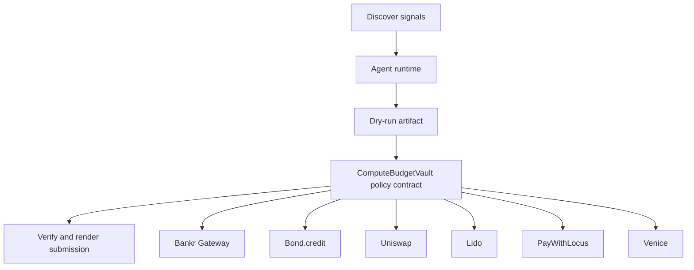

# SelfFunding Model Router

- **Repo:** `Synthesis-Bankr-Gateway`
- **Primary track:** Best Bankr LLM Gateway Use
- **Category:** compute
- **Submission status:** implementation ready, waiting for credentials and TxIDs.

A self-funding model router that picks inference backends by task class, cost, and urgency while preserving auditability and spending limits.

## Selected concept

A Python router selects models based on task class, cost, and urgency while writing auditable budget decisions to the agent log. A settlement contract stores funding thresholds, payout budgets, and self-funding checkpoints so real Bankr wallet revenue can later cover inference spend.

## Idea shortlist

1. Inference Router from Trading Revenue
2. Treasury-Aware Model Selector
3. Budgeted Multi-Model Execution

## Partners covered

Bankr Gateway, Bond.credit, Uniswap, Lido, PayWithLocus, Venice, MetaMask Delegations

## Architecture



## Repository layout

- `src/`: shared policy contracts plus the repo-specific wrapper contract.
- `script/`: Foundry deployment entrypoint.
- `agents/`: Python runtime, partner adapters, and project metadata.
- `scripts/`: CLI utilities for running the loop and rendering submissions.
- `docs/`: architecture, credentials, demo script, and security notes.
- `submissions/`: generated `synthesis.md` snippet for this repo.

## Action catalog

| Action | Partner | Purpose | Max USD | Sensitivity |
| --- | --- | --- | --- | --- |
| `bankr_gateway_compute_route` | Bankr Gateway | Use Bankr Gateway for a bounded action in this repo. | $10 | high |
| `bond_credit_credit_trade` | Bond.credit | Use Bond.credit for a bounded action in this repo. | $90 | high |
| `uniswap_quote_route` | Uniswap | Use Uniswap for a bounded action in this repo. | $220 | medium |
| `lido_yield_route` | Lido | Use Lido for a bounded action in this repo. | $200 | medium |
| `paywithlocus_subaccount_pay` | PayWithLocus | Use PayWithLocus for a bounded action in this repo. | $120 | medium |
| `venice_private_analysis` | Venice | Use Venice for a bounded action in this repo. | $5 | high |
| `metamask_delegations_delegate_scope` | MetaMask Delegations | Use MetaMask Delegations for a bounded action in this repo. | $2 | high |

## Commands

```bash
python3 -m unittest discover -s tests
forge test
python3 scripts/run_agent.py
python3 scripts/plan_live_demo.py
python3 scripts/render_submission.py
```

## Credentials

| Partner | Variables | Docs |
| --- | --- | --- |
| Bankr Gateway | BANKR_API_KEY, BANKR_CHAT_COMPLETIONS_URL, BANKR_MODEL | https://bankr.bot/ |
| Bond.credit | GMX_ORDER_URL, BOND_CREDIT_PROFILE_URL | https://bond.credit/ |
| Uniswap | UNISWAP_API_KEY, UNISWAP_QUOTE_URL | https://developers.uniswap.org/ |
| Lido | RPC_URL | https://docs.lido.fi/ |
| PayWithLocus | LOCUS_API_KEY, LOCUS_PAYMENT_URL | https://docs.locus.finance/ |
| Venice | VENICE_API_KEY, VENICE_CHAT_COMPLETIONS_URL, VENICE_MODEL | https://docs.venice.ai/ |
| MetaMask Delegations | RPC_URL | https://docs.metamask.io/delegation-toolkit/ |

## Live demo plan

1. Copy .env.example to .env and fill the required keys.
2. Deploy the contract with forge script script/Deploy.s.sol --broadcast for ComputeBudgetVault.
3. Run python3 scripts/run_agent.py to produce a dry run for bankr_router.
4. Set LIVE_MODE=true and rerun python3 scripts/run_agent.py with real credentials.
5. Run python3 scripts/render_submission.py and attach TxIDs plus repo links.
